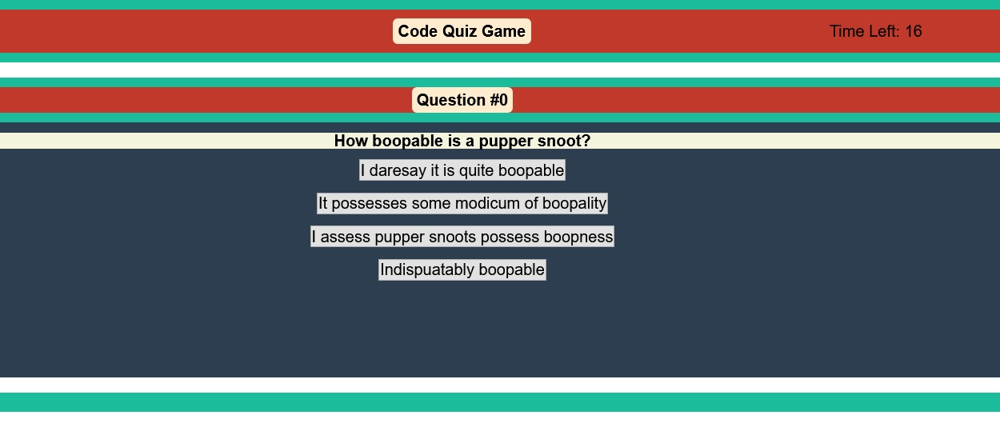

# Code Quiz

## Description

This quiz application presents players with a series of questions. A game timer starts on clicking "Play". The player progresses by answering a question correctly. Incorrect answers are penalized by removing time from the timer. The game ends is defeat if the player fails to answer all questions in the allotted time. The player wins if all questions are answered with time remaining. On victory, the player is prompted to save their score to local storage. Players can view scores from previous games.

## Table of Contents

- [Installation](#installation)
- [Usage](#usage)
- [Questions](#Questions)
- [License](#License)

## Usage

Click on the screenshot below to see the application!

## Questions

Questions? Reach out to me:

GitHub: [comatosino](https://github.com/comatosino)

Email: adamsiii.robert@gmail.com

## License
    
This project is covered under the [MIT](https://opensource.org/licenses/MIT) license.
    

