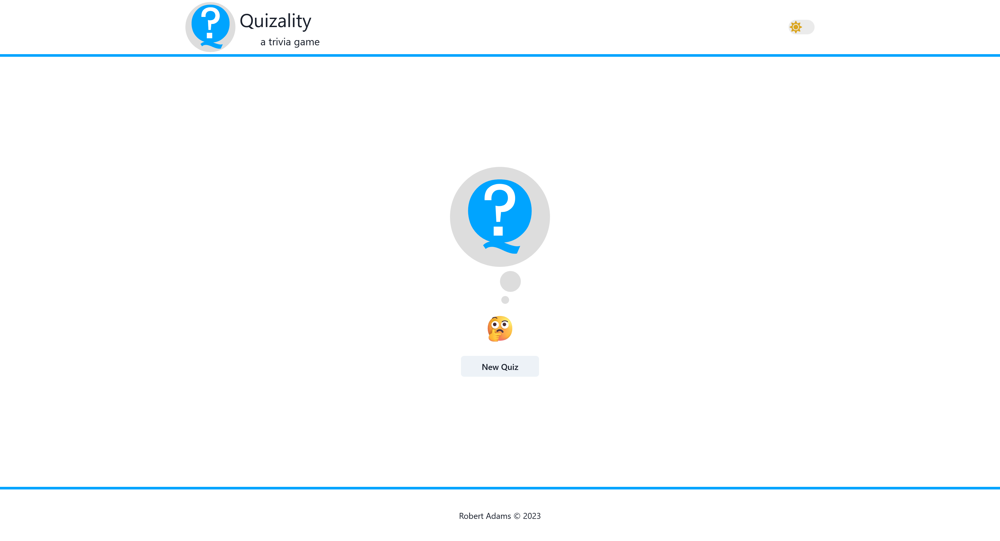

[](https://opensource.org/licenses/MIT)
[](https://r0b4dams.github.io/quizality/)
[](https://github.com/prettier/prettier)
[](https://github.com/eslint/eslint)

<div align="center">
  <image src="public/logo.svg">
  <h1>Quizality</h1>
</div>

## Description

A web application where you can create your own quizzes. Challenge yourself to trivia!

## Installation

```bash
# clone the app
git clone git@github.com:r0b4dams/quizality.git

# install dependencies
yarn
```

## Usage

Click on the screenshot to check out the app!

[](https://r0b4dams.github.io/quizality/)

## Technologies

- Vite
- Typescript
- Redux Toolkit
- Chakra UI
- Framer Motion
